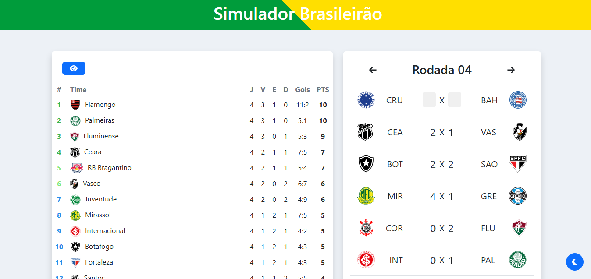

# 🏆 Simulador Brasileirão

Simule partidas do **Campeonato Brasileiro Série A** com placares personalizados e veja em tempo real como os resultados afetam a tabela de classificação!



## 📌 Funcionalidades

- ✅ Exibição da tabela do Brasileirão 2024
- 🎮 Simulação interativa dos placares das partidas
- 🔄 Atualização automática da tabela de classificação
- 🔍 Filtro por rodadas e busca por times
- ⚙️ Interface moderna, responsiva e intuitiva

## 🚀 Tecnologias utilizadas

### Frontend:
- **React**
- **Bootstrap**
- **Axios**

### Backend:
- **Node.js**
- **Express**
- **PostgreSQL**


## 📦 Como executar o projeto localmente

### 1. Clone o repositório

```bash
git clone https://github.com/LucasBondeDeSouza/simulador-brasileirao.git
cd simulador-brasileirao
```

### 2. Instale as Dependências

```bash
cd ../frontend
npm install
```

### 3. Inicie o servidor

```bash
npm run dev
```

### 4. Acesse no navegador

```bash
http://localhost:5173/
```
